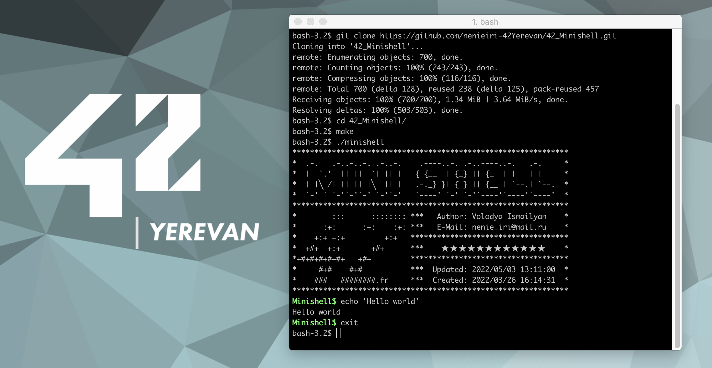

# Minishell
_As beautiful as a shell_

__42 project__ about creating a simple shell. MiniShell will introduce you to the world of shells, which provide a convenient text interface to interact with your system. Shells might seem very easy to understand but have very specific and defined behaviour in almost every single case, most of which will need to be handled properly.

## Introduction
The existence of shells is linked to the very existence of IT. At the time, all developers agreed that communicating with a computer using aligned 1/0 switches was seriously irritating. It was only logical that they came up with the idea of creating a software to communicate with a computer using interactive lines of commands in a language somewhat close to the human language. Thanks to Minishell, you’ll be able to travel through time and come back to problems people faced when Windows didn’t exist.

___
## Prerequisites
The shell needs to do a bunch of stuff, so just make sure you don’t do the following stuff:

- Have very spaghetti code which makes adding stuff in the future very hard, as doing it properly will make it easier to do projects like 21sh and 42sh;
- Wildcard and priority support will take you another month at the least, if you want to do them, make sure you have the according amount of time to do them;
- Do not leak memory and leak file descriptors (also not in your child processes on command execution);
- The shell must not crash in any scenario, its a shell, the only possible interaction you have with your OS, dont let it crash as then you shall be doomed.

___
## About the project
The behavior of the minishell is heavily based on the bash behavior. For every point, take bash as a reference. It is implemented with the rules described below.

Implement the following ___builtins___:
- `echo` and the `-n` option
- `cd` only with an absolute or relative path
- `pwd` without any options
- `export` without any options
- `unset` without any options
- `env` without any options or arguments
- `exit` without any options

Implement the following ___functions___:
- Display a __prompt__ while waiting for a new order.
- Have a working __history__.
- Find and launch the correct executable (based on a PATH environment variable or using an absolute path).
- Handle `’` __(single quote)__ which should prevent the shell from interpreting the metacharacters in the quoted sequence.
- Handle `"` __(double quote)__ which should prevent the shell from interpreting the metacharacters in the quoted sequence except for $ (dollar sign).
- `’` and `"` must work as in bash, except multiline.
- Implement __redirections__:
    - `<` should redirect input.
    - `>` should redirect output.
    - `<<` should be given a delimiter, then read the input until a line containing the delimiter is seen. However, it doesn’t have to update the history!
    - `>>` should redirect output in append mode.
- Implement __pipes__ (| character). The output of each command in the pipeline is connected to the input of the next command via a pipe.
- Handle __environment variables__  ($ followed by a sequence of characters) which should expand to their values.
- Handle `$?` variable which should expand to the exit status of the most recently executed foreground pipeline.
- Handle `ctrl-C`, `ctrl-D` and `ctrl-\` signals which should have the same behavior as in bash:
    - `ctrl-C` displays a new prompt on a new line.
    - `ctrl-D` exits the shell.
    - `ctrl-\` does nothing.

___
## Installation
> ⚠️ **Warning**: Don't copy/paste code you don't understand: it's bad for you, and for the school.

To use this project you need to clone this repository, by running the following command
``` sh
git clone https://github.com/nenieiri-42Yerevan/42_Minishell.git
```
Then you should go to the cloned repo and run the make command
``` sh
cd 42_Minishell
make
```
After that you will see the executable minishell. Lastly you should run the executable
```sh
./minishell
```
You will be provided with a prompt and can use it as a shell.

___
## Test cases

___
### Additional information
In my implementation I don't use any global variable and the project doesn't have any memory leak.
These are big plus.

